# 🍳 Click_2_Cook — AI Recipe Generator from Food Images

Upload a food image → Get the recipe instantly using AI

Click_2_Cook is an AI-powered recipe generation web application that analyzes food images and generates detailed cooking recipes using Google Generative AI (Gemini).

Instead of manually searching recipes online, users can simply upload an image of a dish, and the system will:

- Identify the ingredients

- Understand the dish

- Generate a complete recipe with cooking steps

The project combines Computer Vision + Generative AI + Streamlit UI to make cooking smarter and more interactive.

## 🚀 Live Application

🌐 Try the app here

https://click2cook.streamlit.app/

## 🧠 How It Works

The system follows this pipeline:

1️⃣ User uploads a food image.

2️⃣ Image is processed and analyzed.

3️⃣ Gemini AI identifies ingredients.

4️⃣ AI generates recipe instructions.

5️⃣ Recipe is displayed to the user.

This allows users to discover recipes instantly from food images.

## ✨ Key Features
### 🍽 Image-Based Recipe Generation

Upload any food image and instantly receive a generated recipe.

### 🧠 AI Ingredient Detection

The system analyzes the image and identifies key ingredients.

### 📋 Step-by-Step Cooking Instructions

Recipes include ingredients, measurements, and cooking steps.

### 🥗 Dietary Considerations

AI can adjust recipes based on dietary preferences.

📸 Supports Multiple Dish Images

Users can upload complex dishes or multiple items.

### 🤖 Conversational AI Cooking Assistant

Users can ask cooking related questions.

## 🛠 Tech Stack
### Programming

- Python

### Framework

- Streamlit

### AI Model

- Google Generative AI (gemini-2.5-flash)

### AI & Data Tools

- LangChain
- Libraries
- streamlit
- google-generativeai
- python-dotenv
- Pillow

## 🖥 System Architecture
User Uploads Image

        ↓
        
Image Processing

        ↓
        
Gemini AI Analysis

        ↓
        
Ingredient Detection

        ↓
        
Recipe Generation

        ↓
        
Recipe Display

The system combines image understanding + language generation to create recipes automatically in Any Language.

## 📷 Application Screenshots

- ### 🏠 Homepage

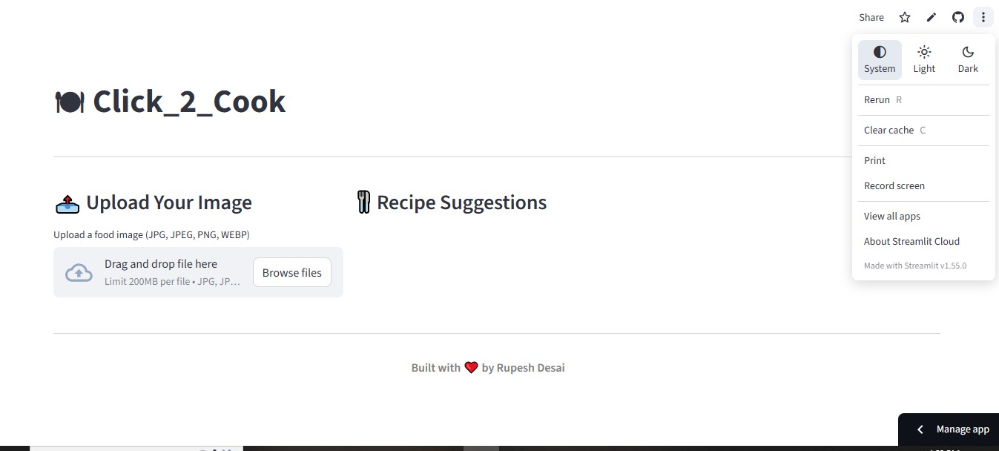

- ### 📂 Upload Image

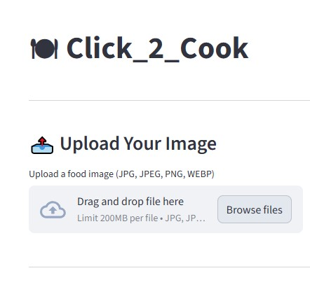

- ### 📤 Uploaded Image

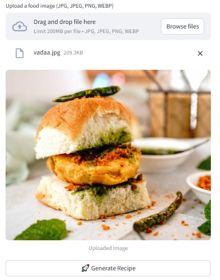

- ### ⚙ Processing Recipe

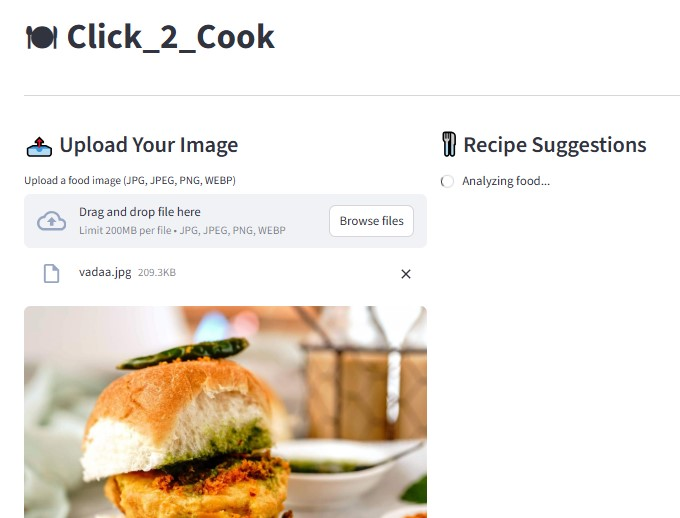

- ### 📋 Generated Recipe

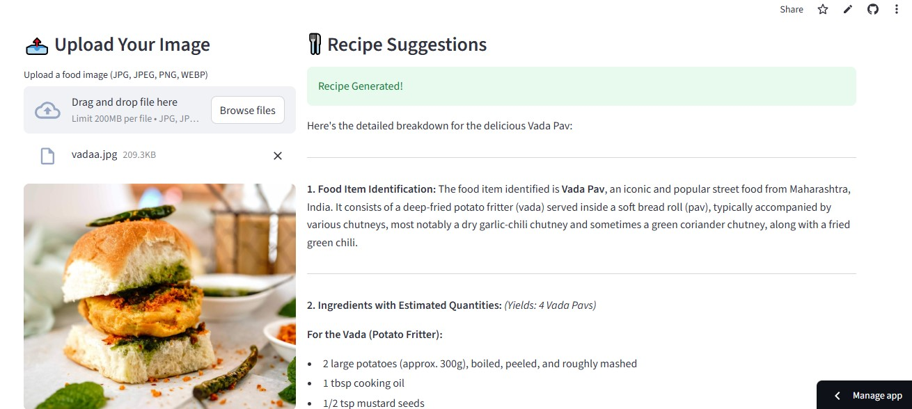

- ### 🍛 Multiple Dish Detection

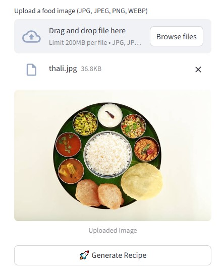

- ### 🤖 AI Generated Output

  
- 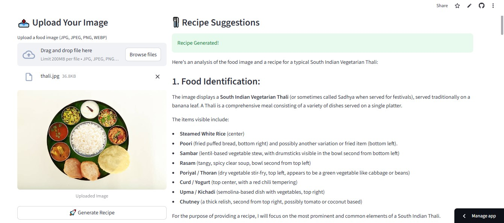
- 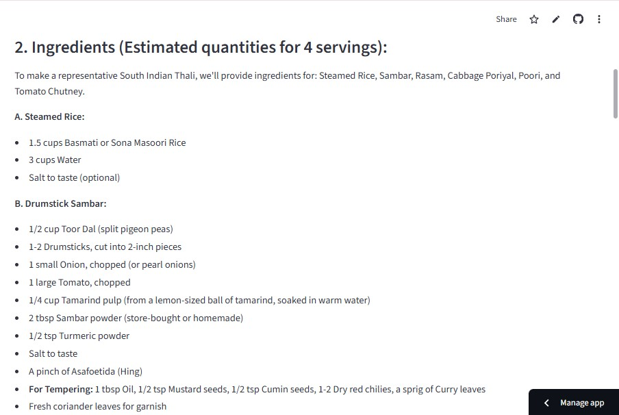
- 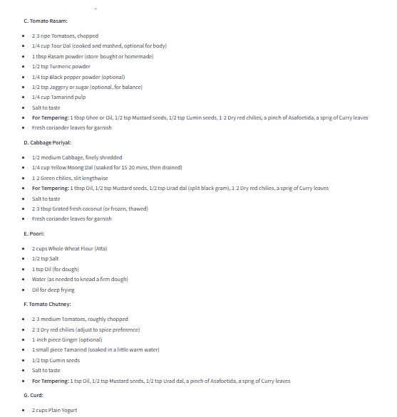
- 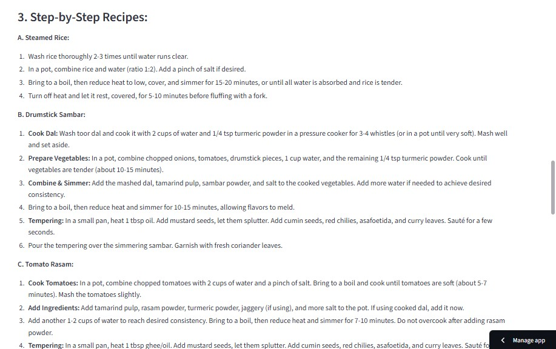
- 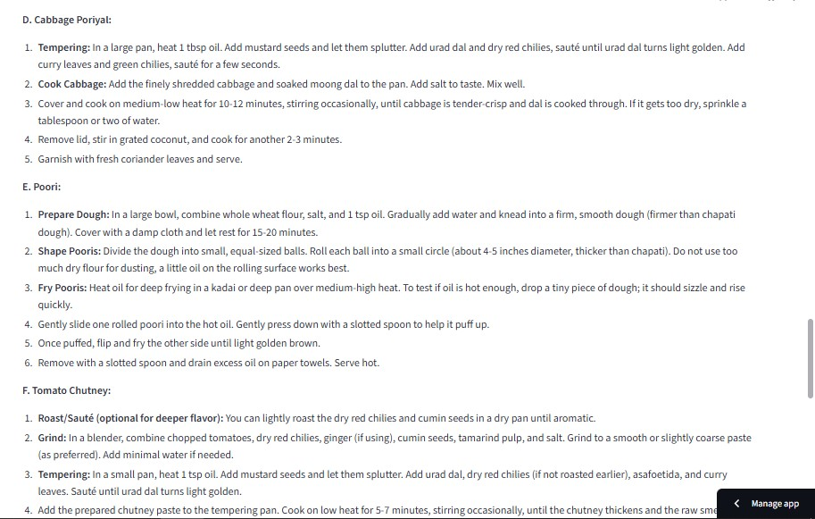
- 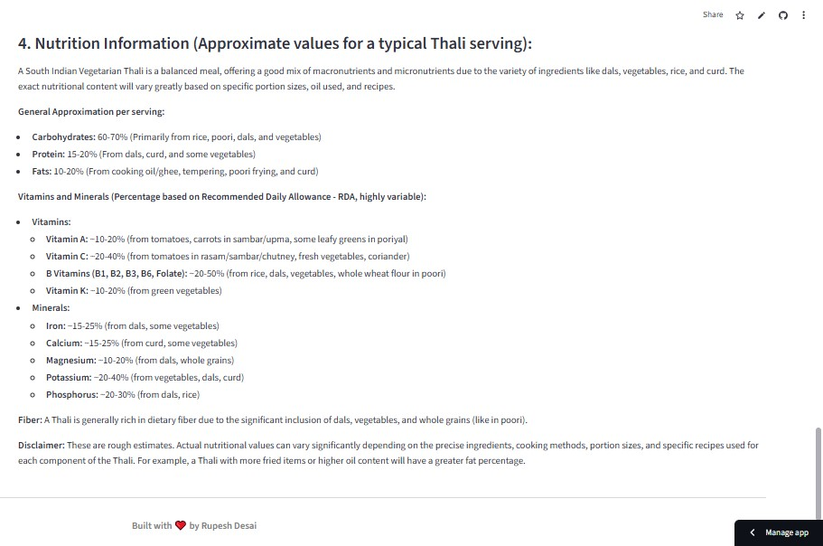

- ### 📊 Example Output

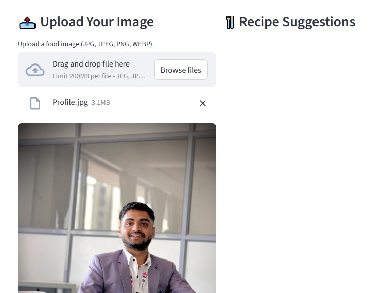

  
- ### Example AI response:

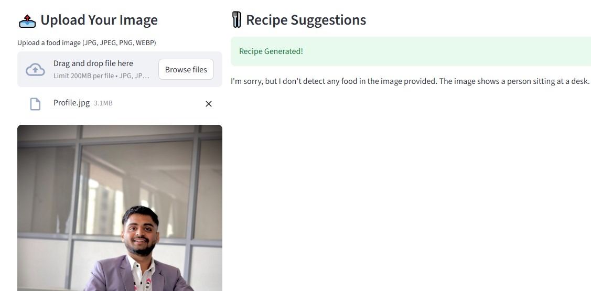

### Ingredient identification

- Quantity estimation
- Cooking instructions
- Dietary variations
- Alternative ingredient suggestions
- The generated recipe includes:
- Ingredients
- Step-by-step cooking instructions
- Estimated servings
- Variations and substitutions

## 💡 Use Cases
- 👩‍🍳 Home Cooking Assistance

Help users cook dishes from images.

- 🥗 Diet Planning

Generate recipes based on dietary needs.

- 📚 Cooking Learning Tool

Help beginners learn cooking.

- 🍴 Food Recognition Applications

Extendable for food recognition systems.

## 📦 Installation & Setup

- Clone the repository:

git clone https://github.com/Rupesh-2010/Click_2_cook.git

- Go to the project directory:

cd Click_2_cook

- Install dependencies:

pip install -r requirements.txt

- Add your Gemini API key:

GOOGLE_API_KEY=your_api_key_here

- Run the app:

streamlit run app.py

## 🔮 Future Improvements

- Multilingual recipe generation

- Personalized recipe recommendations

- Ingredient substitution suggestions

- Community recipe sharing

## 👨‍💻 Author

### Rupesh Desai

Aspiring AIML Developer

- 📧 rupeshdesaiwork@gmail.com

- 🔗 https://www.linkedin.com/in/rupeshdesai2010/

## ⭐ Support

If you found this project interesting:

⭐ Star the repository
🍴 Fork the project
🚀 Share it with others

## 🍲 Final Thought

### Click → Cook → Enjoy

- Click_2_Cook makes cooking faster, smarter, and AI-powered.
